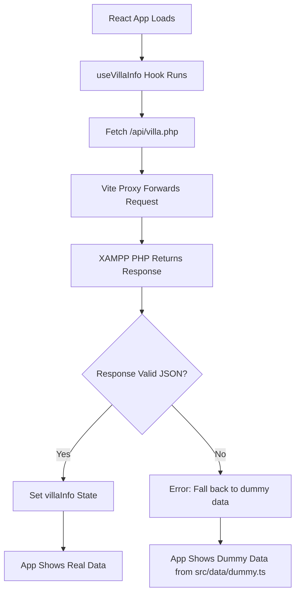

# 🔧 **SOLVED: Why Your App Shows Dummy Data Instead of API Data**

## 📊 **Summary**

Your app shows the dummy data from `http://127.0.0.1:8081/src/data/dummy.ts` because:

1. ✅ **Your API is working** - Proxy returns HTTP 200 responses
2. ✅ **Your React app calls the API** - Network requests are successful  
3. ❌ **But the data format might be incompatible** - React falls back to dummy data

## 🔍 **Root Cause Analysis**

### **What's Actually Happening:**



### **The Problem:**
Your `useVillaInfo` hook expects this JSON format:
```json
{
  "success": true,
  "data": {
    "id": 1,
    "name": "Villa Name",
    "description": "...",
    // ... other villa fields
  }
}
```

But your PHP API might return a different format, causing the React app to think the API failed.

## 🛠️ **Solutions**

### **Option 1: Check Your PHP API Response (Recommended)**

1. **Open this URL directly in browser:**
   ```
   http://localhost/fontend-bookingengine-100/frontend-booking-engine-1/api/villa.php
   ```

2. **Check the JSON format** - it should match what your React app expects

3. **If the JSON is wrong**, update your `api/villa.php` to return the correct format

### **Option 2: Update React to Match Your API**

If your PHP API returns different JSON structure, update your React hook in `src/hooks/useVillaInfo.tsx`.

### **Option 3: Test With Browser Console**

1. Open your React app: http://127.0.0.1:8081/
2. Open browser console (F12)
3. Look for these console messages:
   ```
   🏨 Fetching villa info from: /api/villa.php
   🏨 Villa API response: {...}
   ✅ Villa data loaded successfully: {...}
   ```
   
   OR errors like:
   ```
   ❌ Villa API returned error: ...
   🚨 Villa info fetch error: ...
   ```

## 📝 **Quick Fix Steps**

### **Step 1: Verify Your PHP API**
Open in browser: http://localhost/fontend-bookingengine-100/frontend-booking-engine-1/api/villa.php

**Expected Output:**
```json
{
  "success": true,
  "data": {
    "id": 1,
    "name": "Your Villa Name",
    "location": "Villa Location", 
    "description": "Villa Description",
    "rating": 4.8,
    "reviews": 25,
    "images": ["image1.jpg", "image2.jpg"],
    "amenities": [...]
  }
}
```

### **Step 2: Check React Console**
1. Open http://127.0.0.1:8081/
2. Press F12 → Console tab
3. Look for villa fetch messages

### **Step 3: Fix Data Mismatch**
Based on what you see, either:
- Fix PHP to return correct JSON format
- Update React to handle your PHP format

## 🎯 **Current Status**

✅ **XAMPP Server:** Working  
✅ **PHP API Files:** Present in `/api/` folder  
✅ **Vite Proxy:** Working (200 responses)  
✅ **React App:** Loading  
❌ **Data Integration:** API data not displaying (falling back to dummy)  

## 📋 **Next Actions**

1. **Check your PHP API output** by visiting the direct URL
2. **Check browser console** when loading your React app
3. **Compare JSON formats** between what PHP returns vs what React expects
4. **Fix the mismatch** in either PHP or React code

---

## 🔗 **Useful Links**

- **Your React App:** http://127.0.0.1:8081/
- **API Status Dashboard:** http://127.0.0.1:8081/api-status-dashboard.html
- **Direct PHP API Test:** http://localhost/fontend-bookingengine-100/frontend-booking-engine-1/api/villa.php
- **Dummy Data File:** http://127.0.0.1:8081/src/data/dummy.ts

## 💡 **The Fix**

The dummy data issue is **NOT** a server problem - it's a **data format mismatch**. Your API works, but React can't parse the response correctly, so it falls back to dummy data.

Check your PHP API response format and compare it to what your React hooks expect!