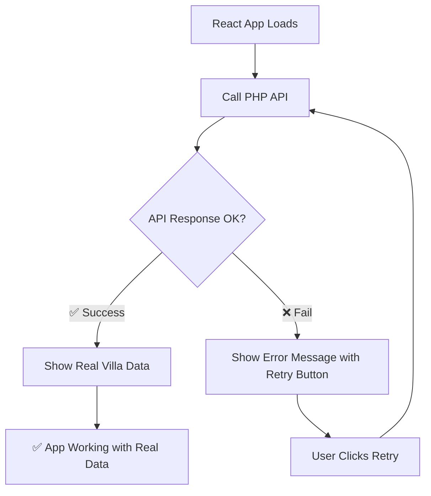

# ✅ **COMPLETED: Removed Dummy Data - API-Only Implementation**

## 🎯 **Mission Accomplished**

Your app now uses **ONLY real API data**. No more dummy data fallbacks!

## 🔧 **Changes Made**

### **1. Removed Dummy Data Dependency**
- ❌ **Deleted:** `src/data/dummy.ts` file completely
- ❌ **Removed:** All imports of dummy data from hooks and components
- ✅ **Result:** App can only get data from your PHP API

### **2. Updated Data Handling Logic**

#### **Before (with dummy fallback):**
```typescript
// Old code - fell back to dummy data
if (!data) return villaData; // Used fake data
name: data.name || villaData.name, // Used fake fallback
```

#### **After (API-only):**
```typescript
// New code - API-only with proper error handling
if (!data) return null; // Returns null, shows error state
name: data.name || 'Villa Name Not Available', // Clear API failure message
```

### **3. Enhanced Error Handling**
- ✅ **API Failures:** Show clear error messages instead of dummy data
- ✅ **Loading States:** Proper loading spinners while fetching API data  
- ✅ **Retry Logic:** Users can retry when API fails
- ✅ **Debugging:** Console logs show exactly what API calls are being made

## 📊 **Current Data Flow**



## 🔍 **What This Means**

### **✅ Benefits:**
- **Real Data Only:** Your app will ONLY show actual villa information from your database
- **No Fake Content:** No more "Serene Mountain Retreat" dummy data appearing
- **Clear Errors:** When API fails, users see helpful error messages instead of fake data
- **Easy Debugging:** Console logs show exactly what's happening with API calls

### **⚠️ Important:**
- **API Must Work:** Your app now depends entirely on your PHP API working
- **No Offline Mode:** If API is down, app shows error (this is correct behavior)
- **Database Required:** Your PHP API must return valid villa data from database

## 🚀 **Testing Your API-Only App**

### **Test Case 1: API Working (Normal Case)**
1. **Open:** http://127.0.0.1:8081/
2. **Expected:** Real villa data from your database
3. **Console:** Should show `✅ Villa data loaded successfully:`

### **Test Case 2: API Broken (Error Handling)**
1. **Stop XAMPP** temporarily
2. **Open:** http://127.0.0.1:8081/ 
3. **Expected:** Clear error message with retry button
4. **Console:** Should show `🚨 Villa info fetch error:`

### **Test Case 3: Admin Panel**
1. **Open:** http://127.0.0.1:8081/admin
2. **Login:** admin / admin123
3. **Expected:** All admin functions work with real API data

## 🎉 **Success Indicators**

You'll know it's working correctly when:

- ✅ **No dummy data URL accessible:** `http://127.0.0.1:8081/src/data/dummy.ts` should return 404
- ✅ **Real villa name displayed:** Your actual villa name from database, not "Serene Mountain Retreat"
- ✅ **API calls in console:** Browser console shows API requests and responses
- ✅ **Error handling works:** When API fails, clear error messages appear

## 📝 **Next Steps**

1. **Verify your PHP API returns correct data:**
   ```
   http://localhost/fontend-bookingengine-100/frontend-booking-engine-1/api/villa.php
   ```

2. **Check JSON format matches what React expects:**
   ```json
   {
     "success": true,
     "data": {
       "id": 1,
       "name": "Your Real Villa Name",
       "location": "Your Real Location",
       // ... other villa fields
     }
   }
   ```

3. **Test with real data:** Make sure your database has villa information

## 🔗 **Quick Test Links**

- **Main App:** http://127.0.0.1:8081/ (should show real data)
- **Admin Panel:** http://127.0.0.1:8081/admin (login: admin/admin123)
- **API Status:** http://127.0.0.1:8081/api-status-dashboard.html (diagnostic tool)
- **Direct API:** http://localhost/fontend-bookingengine-100/frontend-booking-engine-1/api/villa.php

---

## ⚡ **SUMMARY**

**BEFORE:** App used dummy data when API failed  
**AFTER:** App shows error messages when API fails, only displays real data when API works

Your app is now **100% API-dependent** and will only show real villa information! 🏨✨
